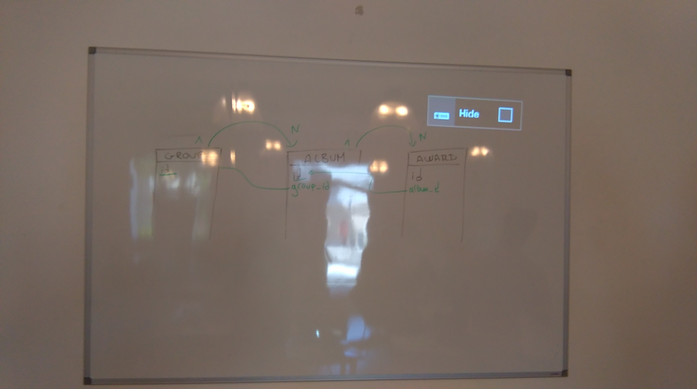
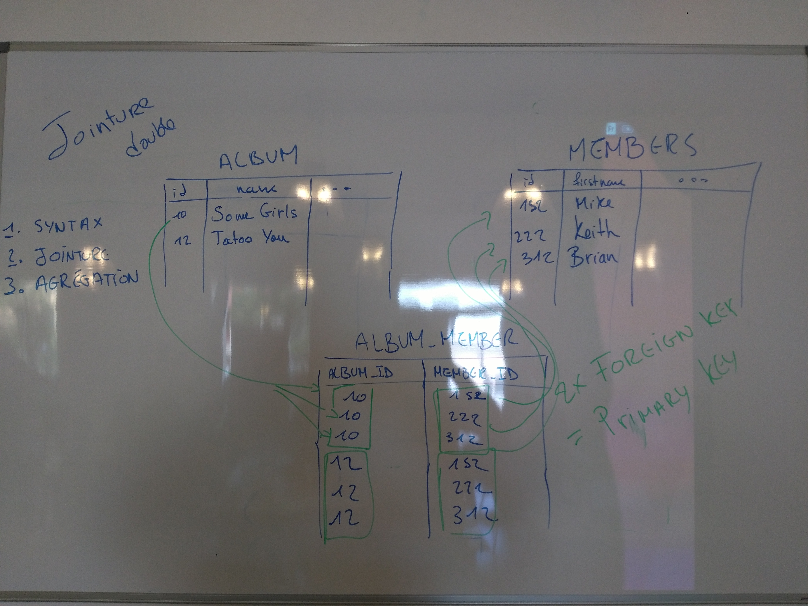

# Music DB
A SQL database to store groups, albums and everything about music !

## Database

We have 4 tables : `group`, `album`, `member`, `award`.


## Relations

We have the following relations:
- there is 1 `group` per `album`
- there is 1 `album` per `award`
- there is M `member` for N `album`



## N to M Relationship

We want an album to recorde the work of many musicians.
And we also want musician to play in many albums. To represent this relation:
we create a new table indexing the relation between members and albums.



## Initialize The Database

You can initialize the database with the command: `mysql < music_db.sql`

## SQL Request With Rename

In the folowing code, we select data from the database renaming the tables `album` as `a` and `group` as `g`. We also rename the column `group.name` as `group_name`.

```SQL
SELECT a.*, g.name AS group_name FROM `album` AS a INNER JOIN `group` AS g ON a.group_id=g.id;
```