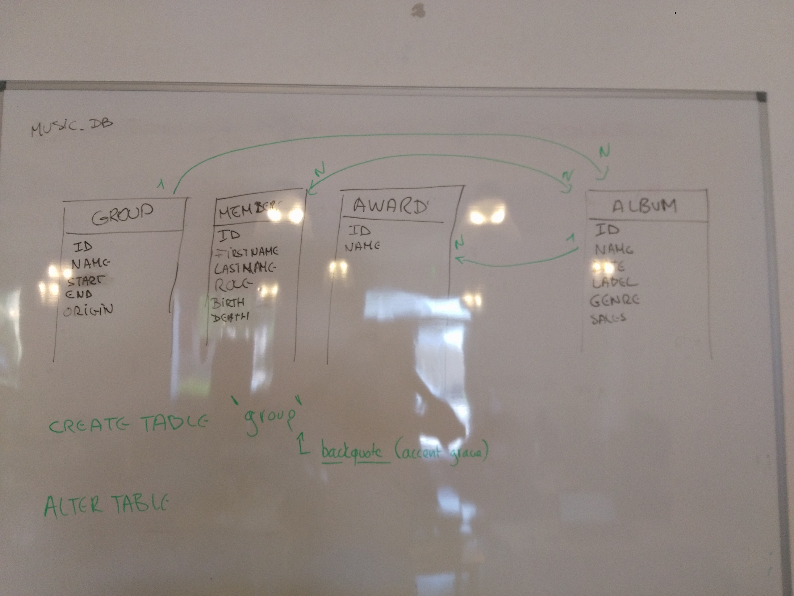

# Music DB
A SQL database to store groups, albums and everything about music !

## Database

We have 4 tables : `group`, `album`, `members`, `award`.

## Relations

We have the following relations:
- there is 1 `group` per album
- there is 1 `album` per `award`
- there is M `menber` for N `album`

